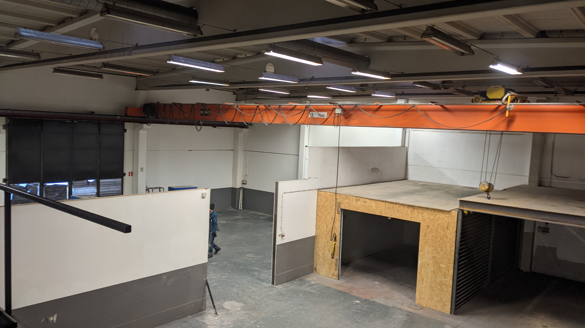
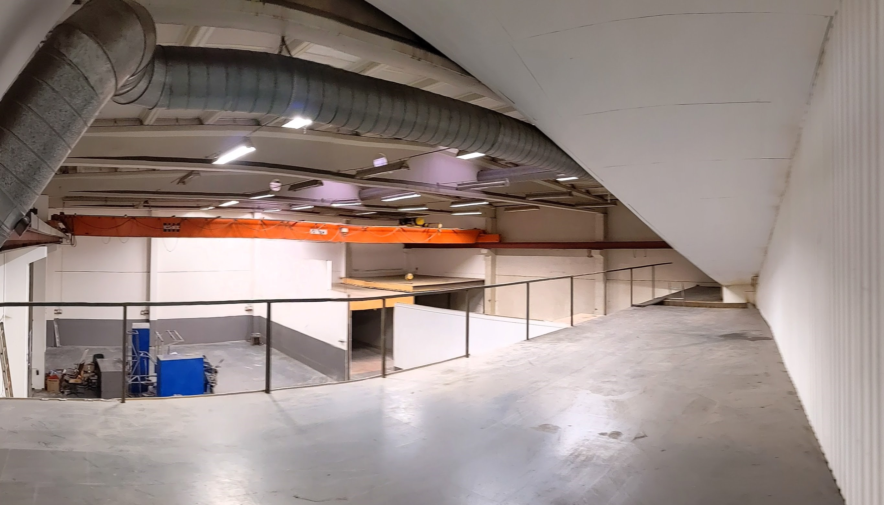
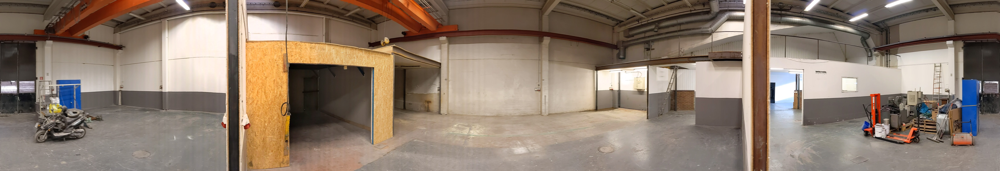
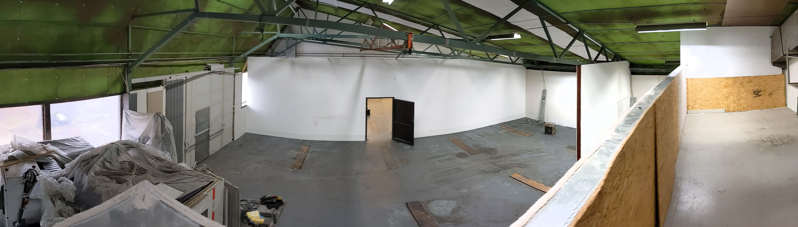
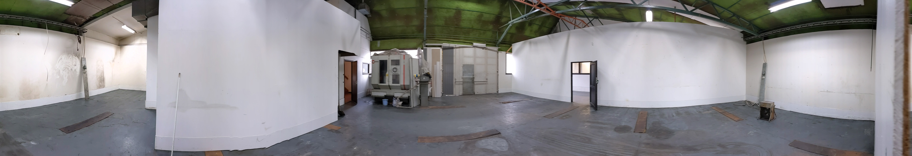
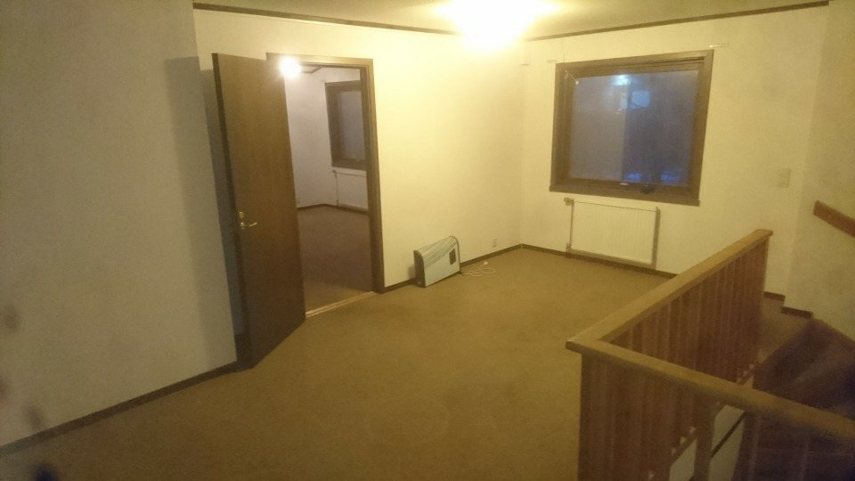
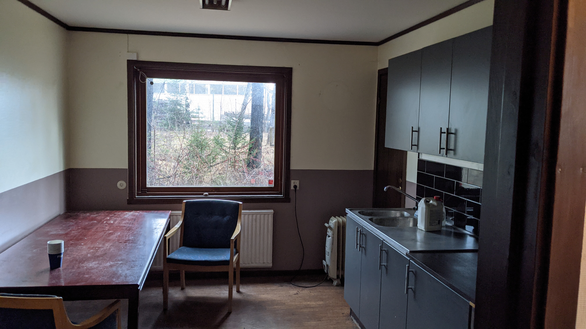
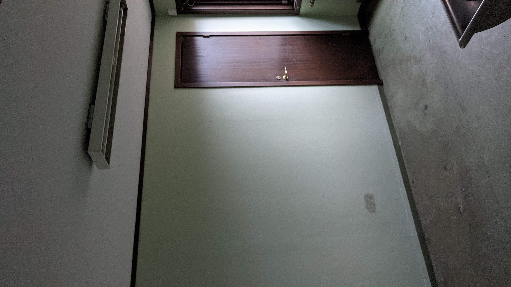

## Råssa 1:14 en fastighet att bygga på

### Info
[Råssa 1:14](https://minkarta.lantmateriet.se/?e=357708.8333333333&n=6395075&z=14&background=2&boundaries=true) ligger i Bollebygds kommun på "flygrakan" 1 km från påfart till Riks40.

Byggander

Address 

### Nya delen
"Nya delen" är en lokal på x m2, med en fullhöjds port (4.5 m) samt möjlighet till travers.

Foto av nya delen från entresol

360 panorama 

[vandring genom lokalen](images/lokalen.mp4)
### Gamla delen

[vandring genom lokalen](images/lokalen.mp4)

### Utsida
Stor yta utvändigt finnes för uppställning av fordon

(fler bilder kommer när utflyttningen slutförts)

### Kontor

### Lunchrum

### Omklädning

### Kontakt
Välkommen att kontakta oss på W-Mek Värmeteknik
[Johan Wranker](mailto:wmek@wranker.org) 0708-613124
[Stefan Munthe](callto:0739103731) 0739-103731
